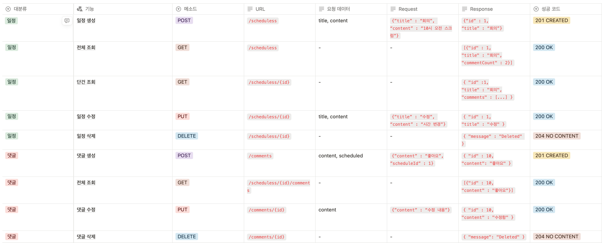
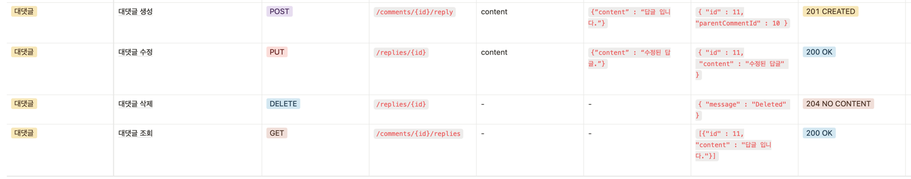
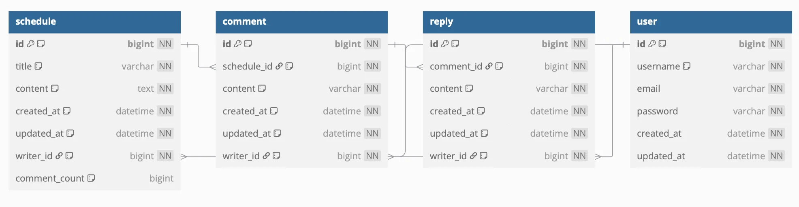
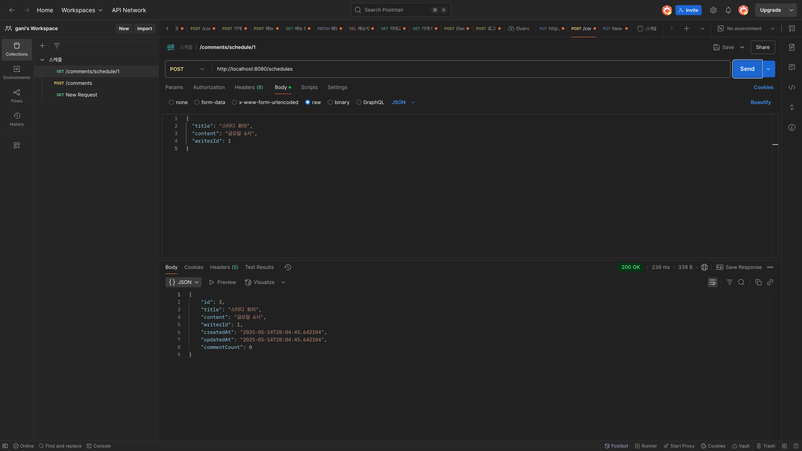
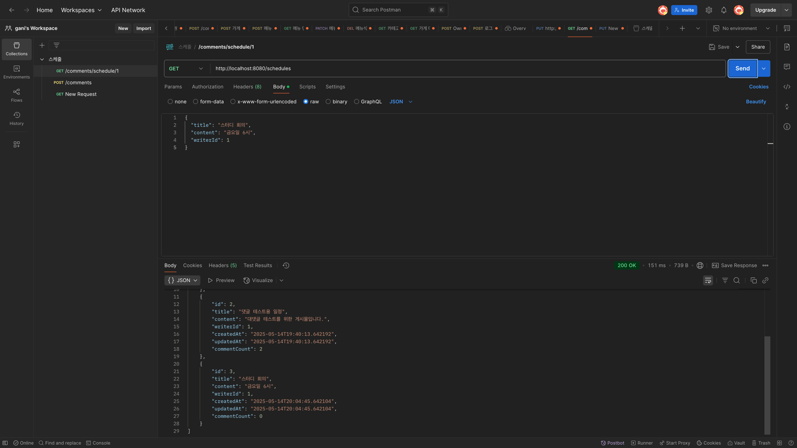
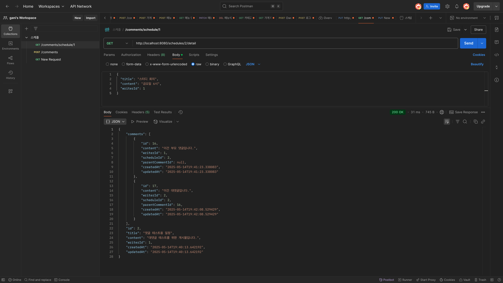
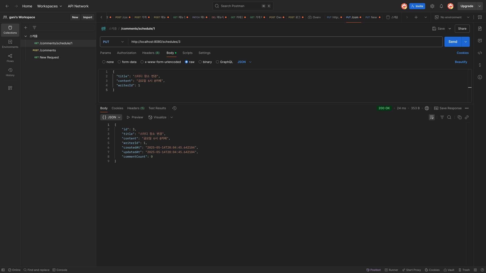
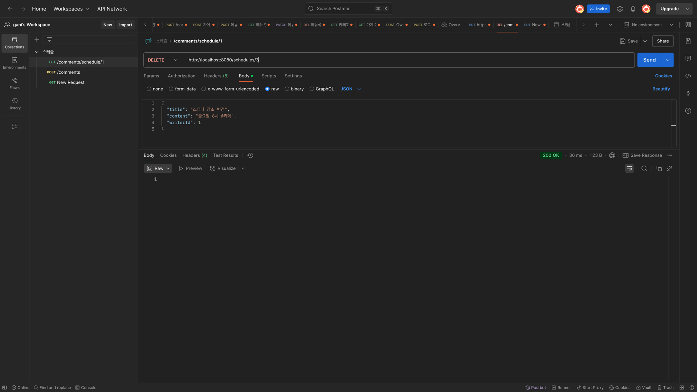

READ ME

# 🗓️ Spring Schedule & Comment CRUD

Spring Boot를 활용한 일정 관리 및 댓글 기능 구현 프로젝트입니다.  
기본적인 CRUD 기능부터 대댓글(1-depth) 기능까지 포함하고 있습니다.

## 📌 프로젝트 소개
- 일정 게시글 생성, 수정, 삭제, 조회
- 게시글당 댓글 생성 및 관리
- 대댓글(1단계) 작성 가능
- 댓글 개수 통계 포함
- 댓글 조회 시 정렬: 부모 → 대댓글 순

## API 명세서

## ERD

## 🧑🏻‍🚀API 동작 캡처본

### 1. 일정 생성

### 2.전체 일정 조회

### 3. 단일 일정 상세 조회 (댓글 포함, 대댓글포함)

### 4. 일정 수정

### 5. 일정 삭제
